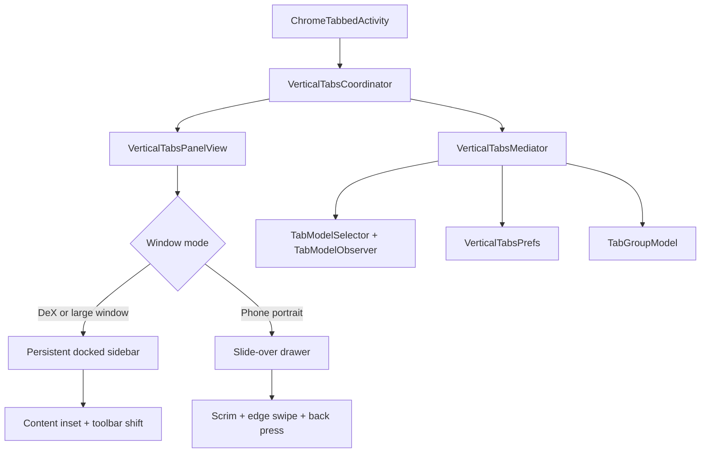

# Titanium Browser — Vertical Tabs UI Plan (Zen/Arc-style)

## 1. Context & Constraints

Titanium Browser is a **patch-based Chromium fork** built on GrapheneOS's Vanadium, targeting Android. There is no forked UI source tree in the repo — everything is delivered as patches applied to a pristine Chromium checkout:

- [`build.sh`](../build.sh) clones Chromium at Vanadium's pinned `VERSION`, applies Vanadium patches via `git am` (with a `vanadium → titanium` string rename), then runs [`patch.sh`](../patch.sh), then `autoninja chrome_public_apk`.
- [`patch.sh`](../patch.sh) makes changes via `sed` one-liners and copies repo files into the tree (e.g. `res/` → `chrome/android/java/res_titanium_base/`, `extensions/dist` → `titanium/`).
- Custom Java overrides live under `titanium/chromium_src/...` inside the Chromium tree (created by the renamed Vanadium patches).
- New GN targets are hooked into `chrome/android/BUILD.gn` via sed (existing example: `//titanium/dist:extension_assets`).
- [`args.gn`](../args.gn) sets `is_desktop_android = true`; the Android bottom bar is force-enabled; extensions toolbar is already injected into `toolbar_phone.xml` via a ViewStub — a proven injection pattern we will reuse.

**Primary use case (per user): Samsung DeX with an external monitor** → the browser runs as a resizable free-form window with mouse + keyboard. **Secondary: phone** → slide-over drawer.

**Implication:** we can and should build a true persistent Zen/Arc-style sidebar for DeX/large windows, and a drawer fallback for phones. Both modes share one core tab-list component.

## 2. Product Specification — Zen/Arc feature mapping

| Zen/Arc feature (desktop) | Titanium Android v1 | Later phase |
|---|---|---|
| Persistent left sidebar with vertical tabs | Persistent docked sidebar on DeX / large window / landscape | — |
| Slide-over access on small screens | Left slide-over drawer with scrim + edge-swipe handle | — |
| Active tab highlight, scroll-to-active | Yes | — |
| Favicon + title + close button per row | Yes | — |
| Pinned tabs / Favorites section | Pref-backed pinned section (Chromium Android has no pinned tabs) | Drag to pin/unpin |
| Folders | Tab groups rendered as collapsible sections with color dot + name | Group rename/color reuse |
| Spaces / Workspaces | Space chips in sidebar header that filter by tab group (v1) | Full workspaces with separate tab sets |
| Compact mode (auto-hide rail) | Collapse to 48dp icon rail; click to expand; mouse-hover expand on DeX | Auto-collapse heuristics |
| Split view | Feasibility spike; interim = open second tab in adjacent Android split-screen window | True in-window split |
| Sidebar web panels (Zen) | Not in v1 | Stretch |
| Tab search | Filter/search box at top of sidebar | — |
| New tab button | `+` button in sidebar header | — |
| Incognito | Separate sidebar list per TabModel (regular/incognito toggle) | — |
| Keyboard shortcuts (DeX) | Toggle sidebar, new tab, close tab, next/prev tab | Full shortcut set |
| Theming | Material You dynamic color, dark mode, incognito dark styling | — |

## 3. Architecture

Two presentation modes over **one core component**:

- **`VerticalTabsPanelView`** (custom `FrameLayout`) — hosts the RecyclerView; supports three visual states: `DOCKED` (persistent, content inset), `DRAWER` (overlay + scrim), `RAIL` (collapsed 48dp icon strip showing pinned/active favicons).
- **`VerticalTabsCoordinator`** — public API (`show/hide/toggle/setMode`), lifecycle wiring, entry points.
- **`VerticalTabsMediator`** — business logic; observes `TabModelSelector`/`TabModelObserver` (tab added/removed/moved/selected, group changes), maintains the item model, issues diff updates to the adapter.
- **`VerticalTabsAdapter`** — RecyclerView adapter; row = favicon + title + close button; section headers for Pinned / Groups; uses `DiffUtil` and a favicon cache (reuse Chromium's favicon resolver used by the grid tab switcher).
- **`VerticalTabsPrefs`** — `SharedPreferencesManager` wrapper: pinned tab IDs, sidebar position (left/right), width, collapsed state, drawer behavior, last selected space.
- **`VerticalTabsDragController`** — `ItemTouchHelper` for reorder, pin/unpin, group assignment.
- **`VerticalTabsSpaceController`** (Phase 4) — space chips = named filters over tab groups; per-space color/icon; persisted in prefs.

### Mode selection
- `DOCKED` when the activity window is large: DeX/free-form window, tablet, landscape — using the same per-window size signal Chromium uses to pick `ToolbarTablet` vs `ToolbarPhone` (recon item R3).
- `DRAWER` otherwise (phone portrait).
- Live re-evaluation on window resize (DeX window resizing, foldables) with animated transition.

## 4. Delivery Mechanism (repo-specific)

1. **New Java files** → `titanium/chromium_src/chrome/android/java/src/org/chromium/chrome/browser/vertical_tabs/*.java`
   - Recon item R1: inspect how the renamed Vanadium patches register `titanium/chromium_src` sources in `chrome_java` (explicit sources list vs glob in `chrome/android/BUILD.gn`) and mirror that mechanism for the new package.
2. **New resources** (layouts, drawables, dimens) → repo `res/vertical_tabs/...` copied by [`patch.sh`](../patch.sh) into `chrome/android/java/res_titanium_base/` (directory already registered in the build — same as `themed_app_icon.xml`).
3. **Modifications to existing Chromium files** → new git patch files in a new `patches/` directory in this repo, applied in [`build.sh`](../build.sh) right after the Vanadium patches (`git am $SCRIPT_DIR/patches/*.patch`). Preferred over sed for anything non-trivial (reviewable, revertible, survives version bumps better). Keep trivial one-liners in `patch.sh` following the existing style.
4. **Feature flag** → `VerticalTabsAndroid`:
   - `ChromeFeatureList.java` constant (same file already patched in `patch.sh` line 32),
   - `chrome/browser/flag-metadata.json` with `expiry_milestone: -1` (existing pattern, `patch.sh` lines 29–31),
   - default-enabled via the `feature_overrides.EnableFeature(...)` block in `chrome/browser/chrome_browser_field_trials.cc` (existing pattern, `patch.sh` lines 36–49),
   - overridable via `chrome://flags`.
5. **Strings** → `chrome/browser/ui/android/strings/android_chrome_strings.grd` via patch.

## 5. Chromium Integration Points (to be confirmed in recon)

| Concern | Expected location (verify) |
|---|---|
| Activity + root layout | `ChromeTabbedActivity.java`, activity root layout (`main.xml` / `control_container.xml`) |
| Web content host | `CompositorViewHolder` / `CompositorView` — inset for DOCKED mode |
| Toolbar | `ToolbarPhone.java` / `ToolbarTablet`, `toolbar_phone.xml`, `ToolbarManager.java` (all already touched by `patch.sh`) |
| Tab data | `TabModelSelector`, `TabModelObserver`, `TabList` (`chrome/browser/tabmodel/...`) |
| Tab groups | `TabGroupModel`, group title/color utilities |
| Grid tab switcher | `tasks/tab_management/` (`TabListCoordinator`, `TabListRecyclerView`) — interplay: hide sidebar when switcher shows; sync selection |
| Favicon + theming | favicon resolver + theme utilities used by tab UI (`tab_ui/android/...`) |
| Back press | `BackPressManager` / `back_press` package (already patched in `patch.sh` line 148) |
| Insets / edge-to-edge | `WindowInsetsUtils` / inset observer infrastructure |
| Bottom bar | `toolbar/bottom/` — optional sidebar toggle button (bottom bar is force-enabled) |
| Settings | `SettingsActivity` + Titanium's `*Ext.java` settings-extension pattern (e.g. `PrivacySettingsExt.java`) |
| Keyboard/mouse (DeX) | activity key dispatch pipeline; `View.OnHoverListener` for rail hover-expand |

### Recon checklist (Phase 0 deliverable: `docs/vertical-tabs-recon.md`)
- R1: How `titanium/chromium_src` Java files are registered in `chrome_java` sources; how to add our package.
- R2: Exact root layout hierarchy of `ChromeTabbedActivity` in the pinned Chromium version; where a docked panel and drawer can be attached.
- R3: The runtime check that selects tablet toolbar / large-window UI (per-window, multi-display aware) — reuse it for mode selection.
- R4: How `CompositorViewHolder` is sized; whether padding/margin cleanly insets web content (small spike: hardcode 280dp inset, verify rendering + touch routing + insets).
- R5: `TabModelObserver` event surface for groups (merge/move/color/title).
- R6: Grid tab switcher show/hide signals to gate sidebar visibility.
- R7: Existing keyboard shortcut dispatch path for adding shortcuts.
- R8: Favicon resolver + theme utility classes to reuse.

## 6. Implementation Phases

### Phase 0 — Recon & scaffolding
- Sync the Chromium checkout at the pinned Vanadium version; complete recon checklist R1–R8; write `docs/vertical-tabs-recon.md`.
- Create `patches/` dir + `build.sh` hook; add `VerticalTabsAndroid` flag (default on, `chrome://flags` overridable); add strings; add `res/vertical_tabs/` resource pipeline.
- **Acceptance:** `chrome_public_apk` builds with the flag present; toggling the flag via `chrome://flags` is observable in logs.

### Phase 1 — Core panel + phone drawer (MVP)
- `VerticalTabsPanelView` + coordinator + mediator + adapter; DRAWER mode only.
- Rows: favicon, title, close button; active highlight; auto-scroll to active; regular/incognito model switch.
- Entry points: toolbar button (ViewStub pattern from extensions toolbar), long-press on tab-switcher counter, edge-swipe from left bezel.
- Scrim, swipe-to-dismiss, back-press closes drawer first (via `BackPressManager`).
- Theming: Material You dynamic colors, dark mode, incognito styling; RTL-aware.
- Persist drawer open/closed per session; on phone, selecting a tab closes the drawer.
- **Acceptance:** on a phone, user can open the drawer, browse/switch/close tabs, and everything survives rotation and process restore.

### Phase 2 — Persistent sidebar for DeX / large windows
- DOCKED mode: dock panel left (or right per pref) at full window height; inset web content + shift toolbar right of the sidebar (recon R2/R4).
- Handle window resize (DeX drag-resize, foldables): mode switch DOCKED ↔ DRAWER with animation; sidebar width in fixed dp, user-resizable via drag handle (min 200dp, max 400dp).
- RAIL collapsed state: 48dp icon strip (pinned + active tabs), click or mouse-hover to expand (DeX mouse), auto-collapse option.
- Keyboard shortcuts: toggle sidebar, new tab, close tab, next/previous tab.
- Grid tab switcher interplay: sidebar hides while switcher is visible; state stays consistent.
- **Acceptance:** in a DeX window the browser looks and behaves like Zen/Arc: persistent sidebar, content properly inset, no rendering/touch glitches, resize-safe.

### Phase 3 — Tab management
- Pinned section: pin/unpin via context menu and drag; IDs persisted in prefs; graceful handling of stale IDs after tab restore.
- Tab groups as collapsible sections: color dot, name, collapse/expand state persisted; create group from selection; move tabs between groups via drag.
- Context menu per row: close, close others, duplicate, pin/unpin, add to group, move to incognito, share.
- Multi-select mode (long-press enters selection; reuse `TabListEditor` patterns if practical).
- Search/filter box at top of sidebar (fuzzy match on title/URL).
- Drag & drop reorder within and across sections (`ItemTouchHelper`).
- **Acceptance:** all Zen/Arc daily-driver tab operations work from the sidebar alone.

### Phase 4 — Spaces/Workspaces v1 + split-view spike
- Space chips in sidebar header (All + user spaces); a space = named/color filter over tab groups; switching space filters the list and updates the `+` button context; per-space pinned sets.
- Split-view spike (time-boxed): assess hosting two live `WebContents` side-by-side in one activity; document feasibility. Interim feature: "Open in split screen" context action launching a second free-form window next to the current one on DeX.
- **Acceptance:** spaces usable for work/personal separation; split-view decision documented with a go/no-go.

### Phase 5 — Settings, a11y, polish, QA
- Settings section (via Titanium's settings-extension pattern): enable/disable, position left/right, default width, compact mode, hover-expand, close-drawer-on-select, space management.
- Accessibility: TalkBack labels/announcements for rows and state changes, focus order, keyboard navigation through the list.
- Animations: drawer/dock transitions, tab-switch highlight, reorder feedback — match Chromium motion specs.
- Performance: RecyclerView recycling, `DiffUtil`, favicon caching, verify 200-tab profile scrolls at 60fps; no startup-time regression.
- Tests: JUnit for mediator/prefs/space logic; instrumentation tests for panel behavior; manual QA matrix below.
- CI: green build on GitHub Actions; update README with feature docs + screenshots.
- **Acceptance:** QA matrix passes; CI release build produced.

## 7. Risks & Mitigations

| Risk | Mitigation |
|---|---|
| sed/patch fragility across monthly Chromium bumps | Prefer new files over edits; anchor patches on stable context; keep a version-bump checklist; recon doc updated each bump |
| Web-content inset glitches (rendering, touch, insets) in DOCKED mode | Early time-boxed spike (R4) in Phase 0/2; fallback = overlay-docked sidebar with content padding only |
| DeX window resize edge cases | Dedicated resize test pass; mode re-evaluation on every configuration change |
| Conflicts with grid tab switcher state machine | Explicit visibility gating; integration tests |
| `chrome_java` build registration for new files | Solved in R1 before writing code |
| Performance with many tabs | Virtualized RecyclerView, diff updates, favicon cache |
| Scope creep (split view, web panels) | Split view = spike + go/no-go; web panels deferred |

## 8. Manual QA Matrix

- Samsung DeX external monitor: dock, resize, rail hover, keyboard shortcuts, mouse.
- Free-form window on Android large-screen/foldable; split-screen with another app.
- Phone portrait (drawer) and landscape (docked); tablet.
- Incognito toggle; dark/light/dynamic color; RTL locale; TalkBack.
- Tab restore after process death (pinned IDs, groups, spaces).
- 200-tab profile: scroll, search, drag performance.

## 9. Key Decisions (defaults, adjustable)

- Flag `VerticalTabsAndroid` **enabled by default**, overridable in `chrome://flags`.
- Sidebar default width 280dp, position left, user-adjustable.
- On phones, selecting a tab closes the drawer; on DeX it stays open.
- Spaces v1 = group-based filters; full workspace tab-sets only if v1 proves insufficient.
